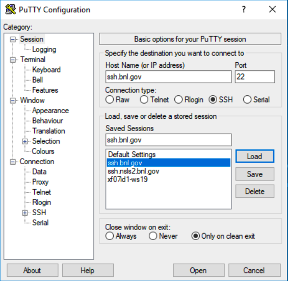
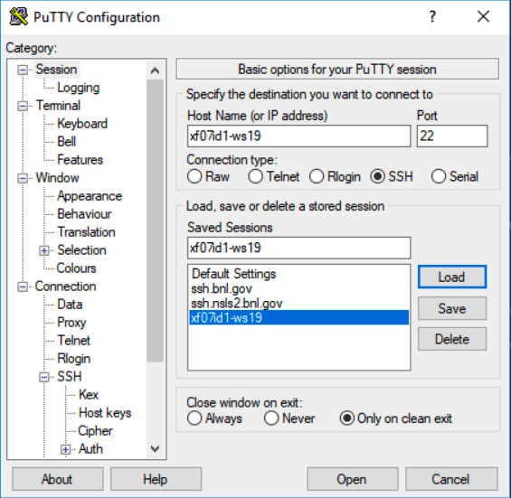

# PuTTY configuration with multiple-hop proxies and port forwarding

Here are PuTTY configuration steps to allow connections to the NSLS-II machines on the experimental floor, which are behind 2 firewalls: BNL's VPN and the NSLS-II controls gateway. This will require setting up multiple-hop proxies and port forwarding via a tunnel to allow access to internal systems, e.g. Jupyter instances.

## Generate a public/private key pair

This step is needed to allow password-less access of the machines. The steps can be found in https://www.ssh.com/ssh/putty/windows/puttygen. Follow BNL cybersecurity requirements, i.e. use a password to protect your private/public key pair. See https://www.bnl.gov/itd/unix/ssh/ for more details. Add the contents of your public key to each machine's `~/.ssh/authorized_keys` file.

*Note*: Use `Pagent` program to keep your keys "active", so that you don't have to enter the key protection password every time you connect.

## Proxies set up

### First hop: BNL ssh gateway

Create a new session to connect to `ssh.bnl.gov`:



**The following 2 steps are needed for all connections explained below.**

In the "Connection" -> "Data" menu enter your username:


Enter the path to the private (`.ppk`) key file, generated on the first step:


### Second hop: NSLS-II ssh gateway

Create a new session (by copying the existing one):


Configure proxy parameters to use the previously defined BNL ssh gateway (`ssh.bnl.gov`) as a proxy:


The following command is entered into the "local proxy command" field:
```
plink.exe %user@%proxyhost -P %proxyport -nc %host:%port
```
See https://stackoverflow.com/questions/28926612/putty-configuration-equivalent-to-openssh-proxycommand for details.


### Workstation on the NSLS-II experimental floor

Create a new session (by copying the existing one):



Optionally configure the X11-forwarding:


This requires installation and starting of https://sourceforge.net/projects/vcxsrv on the Windows machine.

Configure proxy parameters to use the previously defined NSLS-II ssh gateway (`ssh.nsls2.bnl.gov`) as a proxy:


## Tunneling ports

If you want to forward some specific ports from the remote workstation, the following configuration will do the trick:


See a more thorough explanation here: https://blog.devolutions.net/2017/04/how-to-configure-an-ssh-tunnel-on-putty.


## Summary:

Now you should be able to connect to `xf07id1-ws19` (a machine on the experimental floor) without a password "jumping" through the 2 proxies defined above, and have access to the forwarded port `8890`. In the example above, the port `8890` of a Jupyter server running on `xf07id1-ws19`, will be forwarded to the same local port on the Windows machine, so the Jupyter interface can be accessed on that machine via http://localhost:8890:


Enjoy!

----

## Other goodies:

A free/time-limited/unactivated MS Windows VirtualBox image can be used for testing purposes: https://developer.microsoft.com/en-us/microsoft-edge/tools/vms.
